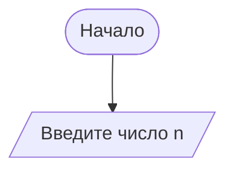

# Блок-схема алгоритма: Бинарный поиск в упорядоченном массиве

**Описание алгоритма:**
Алгоритм бинарного поиска находит индекс заданного элемента в **отсортированном по возрастанию** массиве. Принимает на вход массив `arr` и искомое значение `target`. Возвращает индекс элемента, если он найден, или `-1`, если элемент отсутствует. Работает за O(log n) за счёт деления массива пополам на каждом шаге.

## Диаграмма

```mermaid
flowchart TD
    A([Начало]) --> B[/Ввод: массив arr, target/]
    B --> C[left = 0, right = length(arr) - 1]
    C --> D{left <= right?}
    
    D -- Нет --> E[/Вывод: -1/]
    E --> F([Конец])
    
    D -- Да --> G[mid = (left + right) / 2]
    G --> H{arr[mid] == target?}
    
    H -- Да --> I[/Вывод: mid/]
    I --> F
    
    H -- Нет --> J{arr[mid] < target?}
    
    J -- Да --> K[left = mid + 1]
    K --> D
    
    J -- Нет --> L[right = mid - 1]
    L --> D
```

---
## Описание шагов алгоритма

| Шаг | Действие | Пояснение |
|-----|----------|-----------|
| 1 | Начало | Старт алгоритма |
| 2 | Ввод: массив arr, target | Получаем отсортированный массив и искомое значение |
| 3 | left = 0, right = length(arr) - 1 | Устанавливаем начальные границы поиска |
| 4 | left <= right? | Проверяем, есть ли ещё элементы для поиска |
| 5 | Вывод: -1 (если границы сошлись) | Элемент не найден, возвращаем -1 |
| 6 | mid = (left + right) / 2 | Находим середину текущего отрезка |
| 7 | arr[mid] == target? | Сравниваем средний элемент с искомым |
| 8 | Вывод: mid (если равны) | Элемент найден, возвращаем его индекс |
| 9 | arr[mid] < target? | Проверяем, в какой половине искать дальше |
| 10 | left = mid + 1 (если меньше) | Искомое больше → отбрасываем левую половину |
| 11 | right = mid - 1 (если больше) | Искомое меньше → отбрасываем правую половину |
| 12 | Конец | Завершение работы алгоритма |

---
# Ответы на контрольные вопросы
 
## Вопрос 1. Что такое Mermaid и для чего он используется?
 
**Mermaid** — это инструмент для генерации диаграмм и графиков из текстового описания. Используется для встраивания визуализаций (блок-схем, последовательностей, диаграмм Ганта и др.) в Markdown-документы.
 
---
 
## Вопрос 2. Как вставить диаграмму в Markdown-документ?
 
Диаграмму вставляют с помощью блока кода с указанием языка `mermaid`:
 
````markdown

````
 
---
 
## Вопрос 3. Какие типы узлов (фигур) доступны в блок-схемах Mermaid?
 
| Синтаксис     | Форма                            | Назначение              |
|---------------|----------------------------------|-------------------------|
| `[Текст]`     | Прямоугольник                    | Процесс                 |
| `{Текст}`     | Ромб                             | Условие / решение       |
| `([Текст])`   | Скруглённый прямоугольник        | Начало / конец          |
| `[/Текст/]`   | Параллелограмм                   | Ввод / вывод            |
| `((Текст))`   | Круг                             | Соединитель             |
| `{{Текст}}`   | Шестиугольник                    | Подготовка / хранение   |
 
---
 
## Вопрос 4. Чем отличаются стрелки `-->` и `-- текст -->`?
 

 
- `-->` — стрелка без подписи, соединяет узлы напрямую.
- `-- текст -->` — стрелка с текстовой подписью (обычно используется для обозначения ветвлений «Да» / «Нет»).

---

## Вопрос 5. Как изменить ориентацию диаграммы с вертикальной на горизонтальную?

 
Для изменения ориентации с вертикальной на горизонтальную нужно в начале диаграммы указать `flowchart LR` (left-right) вместо `TD` (top-down):
 
```
flowchart LR
```
 
В старом синтаксисе аналогично используется `graph LR`.

---

## Вопрос 6. Зачем нужны подграфы (subgraph)?

Подграфы нужны для группировки логически связанных узлов в один блок. Это:
- улучшает читаемость диаграммы;
- позволяет создавать вложенные структуры;
- упрощает редактирование сложных диаграмм.

---

## Вопрос 7. Какие символы нельзя использовать в идентификаторах узлов?
 
В идентификаторах узлов **нельзя** использовать пробелы и большинство специальных символов:
 
`:` `;` `,` `(` `)` `[` `]` `{` `}` `<` `>` `/` `\` `*` `+` `-` `=` `|` `&` `^` `%` `#` `@` `!` `~`
 
**Разрешены:** буквы, цифры и знак подчёркивания `_` (без пробелов).

---

## Вопрос 8. Почему важно указывать начальный и конечный узлы?
 
Начальный и конечный узлы важны, чтобы чётко обозначить точку входа и выхода из алгоритма или процесса. Это:
- делает логику понятной и однозначной при чтении;
- соответствует общепринятым стандартам оформления блок-схем;
- исключает неоднозначность в интерпретации алгоритма.